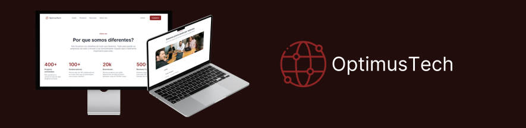

# Projeto OptimusTech

Este projeto foi realizado durante o 7 days of code de HTML e CSS da Alura. O Objetivo dele foi praticar os conceitos mais "básicos" de HTML e CSS. 

Como eu queria praticar principalmente flex-box e me desafiar a realizar o projeto sozinho, ele ainda não está responsivo pois não foi o meu foco no momento.

## Ferramentas utilizadas:

* HTML

* CSS

* Flex-box

## Feito por:

### Andre Maia

### Linkedin: https://www.linkedin.com/in/andre-maia-cunha/